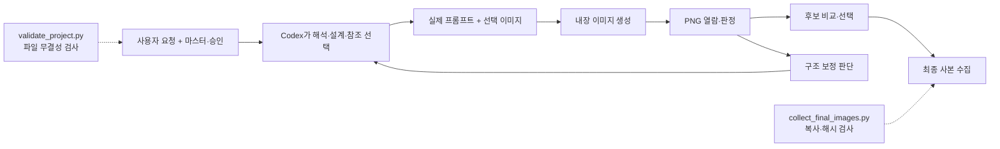

# 이미지 생성 파이프라인 감사 — 2026-09-12

이번 문제의 가장 큰 원인은 **이미 있는 기준을 실제 생성·보정·검수·후보 선택에서 일관되게 적용하지 못한 실행**이다. 형태를 보존하고 붓터치를 살리며 도로 물결을 피하라는 지시는 마스터와 실제 프롬프트에 있었다. 그런데 구조 오류 보정에 집중하며 시각 참조를 줄였고, 건물의 기능적 깊이가 줄거나 표면이 목표와 멀어져도 그 후퇴를 최종 선택에 충분히 반영하지 않았다. 이전의 S03 통과 판정은 재검토 결과 유지할 수 없다.

사용자의 “붓질이 없고 물결처럼 보인다”는 지적은 목표와 실제 표현의 차이를 정확히 짚는다. 엄밀히는 일부 낮은 대비 색 패치가 남고 실제 광학적 굴절은 확인되지 않는다. 그러나 **목표 붓질이 충분히 읽히지 않고 구불거리는 미세 자국이 남은 실패**를 “패치가 조금 있다/실제 유리는 아니다”라는 이유로 통과시켜서는 안 된다.

이번에는 원본3장, 참조, 프로젝트 기준/승인, 실제 호출 인자, 구조 가이드, 검수·선택 기록, 공용 스크립트를 분석했다. 이미지·문서·실행 기록을 각각 독립 분담했다. 시각 감사는 기존 review를 읽기 전에 원본과 참조부터 판단했다. 새 이미지 생성, 마스터·스킬·설정·기존 검수·최종선택 변경, Git 작업은 하지 않았다. 새 감사 문서와 검수 확대본만 저장했다.

**현재 폴더의 실제 작동 방식**

`project.json`은 이미지 모델의 런타임 설정 파일이 아니다. 해당 파일도 `not_a_codex_runtime_config:true`라고 명시한다. 에이전트가 문서를 읽고 직접 지시와 참조를 구성하는 운영 기준이다. 공용 스크립트는 파일 무결성·사본 수집을 담당하고, 장면 설계·참조 선택·도구 호출·시각 검수·보정 선택은 에이전트 판단에 의존한다. [project.json](/Users/hyojinnoh/Documents/Codex/GameConcept_Codex/project.json:50)

파일에 기준이 존재하는 것, 프롬프트에 문장이 들어가는 것, 모델이 이미지를 그렇게 그리는 것, 검수에서 그것을 확인하는 것은 서로 다른 단계다. 현재 파이프라인은 앞의 두 단계에 기록이 많지만 뒤의 두 단계에서 판정 품질이 약하다.

**이번 세 시도의 실제 변화**

| 단계 | 실제 이미지 입력 | 프롬프트 | 관찰된 변화 |
|---|---|---|---|
| 최초 | 구조 가이드 + M02 + M03-10 + M04-02 + B03-01:5장 |10,396자 /1,466단어 | 큰 기계 하우징·굵은 배관·프레임 깊이가 상대적으로 풍부. 기하 실패와 표면 표현 부족은 이미 존재. |
| 보정1 | 구조 가이드 + M03-10 + M04-02 + B03-01:4장 |11,226자 /1,581단어 | 앞 모서리 수직 개선. 공통 투영 실패 지속, 오른쪽 출구 연결은 불확실해짐. |
| 보정2·최종 | 구조 가이드만1장 |6,926자 /976단어 | 두 출구와 기단 균형 개선. 기계 하우징 깊이와 개성 축소. 붓표현·미세 포장 자국 문제 남음. |

문자 수는 실제 `tool_arguments.json`의 prompt 기준이고 모델 내부 토큰 수가 아니다. 세 번 사용한 구조 가이드 PNG는 **동일한 해시**다. “재구성”은 새로 검증한3D 기하를 투입했다는 뜻이 아니라, 같은2D 도해를 서로 다른 참조·문장으로 다시 렌더한 것이다. [최초 실제 입력](/Users/hyojinnoh/Documents/Codex/GameConcept_Codex/outputs/20260912_121353_city_two_cars_appliances/tool_arguments.json) · [보정1 입력](/Users/hyojinnoh/Documents/Codex/GameConcept_Codex/outputs/20260912_121353_city_two_cars_appliances_geometry_rebuild/tool_arguments.json) · [최종 입력](/Users/hyojinnoh/Documents/Codex/GameConcept_Codex/outputs/20260912_121353_city_two_cars_appliances_guide_only_rebuild/tool_arguments.json) · [집계 근거](/Users/hyojinnoh/Documents/Codex/GameConcept_Codex/outputs/20260912_city_pipeline_visual_audit/pipeline_evidence.json)

5경로 제한은 이전 실제 도구 거절로 확인된 기록이 있다. 다만 최종에서3장의 아트/세계관/붓터치 참조를 모두 제거한 이유는 용량 부족이 아니라 “참조 카메라의 영향일 수 있다”는 가설이었다. 그 가설은 검증되지 않았다. 세 번 모두 C04가 실패했고 문장과 참조 수가 동시에 바뀌어 특정 원인을 분리할 수도 없다. “카메라 제외”라는 지시는 실제 참조 영역 마스크나 강제 가중치가 아니다. [실제 한도 거절](/Users/hyojinnoh/Documents/Codex/GameConcept_Codex/outputs/20260912_041307_wasteland_scrap_dealer/tool_rejection.json:5) · [참조 역할의 한계](/Users/hyojinnoh/Documents/Codex/GameConcept_Codex/docs/05_GENERATION_RULES.md:45)

**확인한 실패와 원인**

| 문제 | 확인된 사실 | 원인 판단 |
|---|---|---|
| 건물 단순화 | 층수·돌출·곡면 코너는 남았지만 B의 돌출 기계 하우징이 벽에 붙은 덮개/패널로, A의 복합 기계 부피가 규칙적 그릴/팬으로 축소됨. | 보존 조건을 “4층/2층/기계층/곡면 있음” 정도로 확인하고, 큰 기능 부피·리세스·외벽 깊이의 전후 차이를 확인하지 못함. |
| 붓질 부족 | 일부 색 패치는 있지만 매끈한 렌더·박리·패널·미세 얼룩이 지배. | 목표의 적극 조건인 “온전한 면에서 읽히는 큰 방향성 색 터치”를 확인하지 못함. 마지막에는 그 표현의 이미지 입력도 제거. |
| 도로 물결 유사 패턴 | 반복 균열 군집과 가는 구불거리는 얼룩/긁힘이 남음. | 실제 물/유리 여부에 검수를 좁혀, 물결처럼 읽히는 반복 표면 자국을 놓침. “마른 바닥”은 “목표 표면 표현”과 동의어가 아님. |
| 보정 중 품질 후퇴 | 최종 선택 이유는 연결·정렬 개선 중심. | 수정할 구조 항목만 추적하고 유지해야 할 아트·형태의 후퇴를 별도 탈락 사유로 다루지 않음. |
| 반복되는 미달 결과 | 오늘 저장된 생성 결과22개는 needs_revision17, uncertain5로 통과 상태가 없음. | 기록상 반복 신호다. 같은 보정 전략의 효과를 검증하는 단계가 필요하다. 이것은 새 전수 시각검사나 모델 성공률 추정이 아니다. |
| 기록은 많은데 누락 지속 | 대응표가 ART/STRUCTURE 같은 구역명만 가리키고 사전검사도 포괄적 한 문단으로 축약됨. | 템플릿의 정확한 구절·개별 조건·이미지 근거 연결을 실제 작성에서 생략함. |

단순화를 막는 해결책은 표면의 작은 부품·녹·스크래치를 다시 늘리는 것이 아니다. **큰 실루엣과 깊이는 풍부하게, 표면 미세 자국은 절제하는 두 목표를 따로 관리해야 한다.** 최초의 기계층 자체는 형태 보존의 비교 대상이 될 수 있지만, 그 이미지의 틀린 카메라나 전체 결과를 긍정 마스터로 승격할 근거는 없다. [형태 기준](/Users/hyojinnoh/Documents/Codex/GameConcept_Codex/docs/03_VISUAL_STYLE_V2.md:35) · [세계관의 큰 기능 형태](/Users/hyojinnoh/Documents/Codex/GameConcept_Codex/docs/04_WORLD_DESIGN_V2.md:76)

**기존 검수에서 잘못 적용한 부분**

1. S03를 “유리 물결이 뚜렷하지 않음”만으로 PASS 처리했다. S03는 금지 패턴의 부재뿐 아니라 명확한 입체와 절제된 평면 붓터치의 공존을 요구한다. 긍정 표현이 확인되지 않았고 미세 자국도 남았으므로 **이번 재검토에서는 세 결과의 S03를 FAIL로 정정한다**. 기존 review를 덮어쓰지 않고 [새 재검토 기록](/Users/hyojinnoh/Documents/Codex/GameConcept_Codex/outputs/20260912_city_pipeline_visual_audit/reassessment.json)에 적용 범위를 남겼다.
2. S02를 쓰레기/소품이 한곳에 모였다는 이유로 통과시켰다. 이는 표면 자국의 크기·밀도·방향·여백을 따로 확인한 근거가 아니다.
3. S04에 C04의 기하 실패를 그대로 전파하고 “정확한 모델링 기하 원본이 아니다”를 근거로 썼다. S04는 현재 이미지에서 부피·재질·빛·기계 결합이 읽히는지를 보는 항목이다. 정밀3D 원본 검증을 대신시키면 독립적인 아트 검수가 사라진다. C04 실패는 C04에 유지하고 S04는 별도 관찰해야 한다.
4. 보정본의 R02가 N/A인 것 자체는 오류가 아니다. R02는 새 장소/독립 시안의 차이를 보는 항목이기 때문이다. 대신 **같은 시안의 수정 전후 보존 검사**가 별도로 필요했는데 없었다.
5. 이전 보조 검수도 구조 오류와 투영에 초점이 맞춰져 있었다. 검수자가 여럿이어도 같은 질문과 이전 판정에 집중하면 동일한 누락을 반복할 수 있다. 이번 독립 시각 감사는 이전 review를 읽기 전에 이미지와 아트 기준부터 확인했다.

근거: [QA 정의](/Users/hyojinnoh/Documents/Codex/GameConcept_Codex/docs/06_QA.md:15) · [검수 템플릿](/Users/hyojinnoh/Documents/Codex/GameConcept_Codex/templates/review.md:37) · [기존 최종 검수](/Users/hyojinnoh/Documents/Codex/GameConcept_Codex/outputs/20260912_121353_city_two_cars_appliances_guide_only_rebuild/review.md:31) · [독립 시각 감사와 확대 영역](/Users/hyojinnoh/Documents/Codex/GameConcept_Codex/outputs/20260912_city_pipeline_visual_audit/visual_audit_ko.md)

확대본에서 볼 수 있는 예:
- 최종 도로 약(290,578), (430,672), (633,742), (735,856) 주변에는 비슷한 균열 군집이 반복된다.
- 밝은 주차 포장 약(240,643)–(455,781), 건물 사이 보도 약(550,515)–(733,629)에는 가늘고 구불거리는 선/얼룩이 있다.
- 실제 복사 텍스처, 노멀맵, 유리 셰이더나 물리적 바닥 굴곡이 사용됐다는 뜻은 아니다. **보이는 표면 결과가 목표와 어긋난다**는 판정이다.

[최종 바닥 확대](/Users/hyojinnoh/Documents/Codex/GameConcept_Codex/outputs/20260912_city_pipeline_visual_audit/final_road_2x.png) · [최초 건축 확대](/Users/hyojinnoh/Documents/Codex/GameConcept_Codex/outputs/20260912_city_pipeline_visual_audit/initial_architecture_2x.png) · [최종 건축 확대](/Users/hyojinnoh/Documents/Codex/GameConcept_Codex/outputs/20260912_city_pipeline_visual_audit/final_architecture_2x.png)

**마스터/파일 구성은 무엇이 문제였나**

현행 마스터의 방향은 대체로 일관되고 필요한 내용도 이미 있다.

- 넓고 깨끗한 색면이 모든 건물을 같은 매끈한 상자로 만들라는 뜻이 아님:03:37.
- 온전한 면의 크고 성긴 방향성 색 터치와 손상 분리:03:44–46.
- 물결·굴절유리·작은 모자이크·전면 미세 질감 금지:03:47,52,55.
- 전체 기하 보정 중에도 큰 형태/외벽 깊이 유지:05:60,110.
- 참조의 역할과 실제 전달/검토 구분:05:36–49.

실제 최초와 최종 프롬프트에도 붓터치·마른 도로·물결 금지·형태 보존 지시가 있다. 따라서 “프롬프트에 안 적었다” 또는 “마스터에서 삭제됐다”는 설명은 사실과 다르다. F-01~07은 선택 자료이므로 사용하지 않은 것 자체도 규칙 위반은 아니다. 다만 이번처럼 건축 개성이 중요할 때 실제로 어떤 시각 자료나 형태 계획이 그것을 맡는지 명확해야 한다.

문서의 빈틈은 **구조 보정 종료와 전체 이미지 완성의 구분**이다. project/skill/05에는 구조 통과 후 중단을 반복하고, 아트/외관 검사가 구조 자동 보정 권한을 확대하지 않는다는 설명이 있다. 이는 과거 승인 범위를 지키려는 규칙이지만, 실행 과정에서는 “승인된 아트 기준의 누락”까지 단순 취향처럼 뒤로 미루는 편향을 만들었다. 구조 보정의 권한 제한을 유지하더라도 전체 완성 판정은 모든 적용 품질을 포함해야 한다. [현재 자동 보정 범위](/Users/hyojinnoh/Documents/Codex/GameConcept_Codex/project.json:76) · [보정 중 유지 조건과 중단](/Users/hyojinnoh/Documents/Codex/GameConcept_Codex/docs/05_GENERATION_RULES.md:110)

이때 영구적인 자동 보정 정책을 확대하는 것은 별도 정책 변경이다. 현재 분석 요청을 그 승인으로 간주해 문서를 바꾸거나 이미지를 생성하지 않았다. 반대로 이미 명시된 요구를 검수하고 실패를 정확히 기록하는 데 새 허락이 필요한 것은 아니다.

문서가 AGENTS·START_HERE·skill·01~06·project·templates에 반복돼 있어 작성/검토 부담도 크다. 하지만 **이번에 문맥이 잘렸거나 특정 단어 수를 넘겨 아트 지시가 무시됐다는 증거는 없다**. 글자 수를 줄이는 것만 해결책으로 삼으면 마지막 시도처럼 시각적 근거도 약해질 수 있다. 중복 서술보다 조건별 연결과 관찰 증거를 정리하는 편이 낫다.

**파일 검사에서 확인한 정상 범위와 한계**

`validate_project.py`는 이번에도 PASS했다. 마스터27장, 표면 보조4장, 형태 자료7장/비교4장 등의 파일·해시·역할·승인·버전을 확인하는 검사다. outputs의 JSON은 일반 JSON 검사에서 제외하며, 실제 그림·프롬프트 적용·QA 판단은 검사하지 않는다. 파일 누락 방지 기능이 정상이라고 그림 품질도 정상인 것은 아니다. [검사 코드](/Users/hyojinnoh/Documents/Codex/GameConcept_Codex/scripts/validate_project.py:244)

세 run의 실제 참조 배열·개수·해시, 결과 원본과 사본의 해시/크기는 일치했다. 최종 사본71장도 바이트 동일/중복 없음 검사에 통과했다. `collect_final_images.py`는 복사와 재고 검사이며 그림을 채점하거나 최선 후보를 고르지 않는다. [수집 코드](/Users/hyojinnoh/Documents/Codex/GameConcept_Codex/scripts/collect_final_images.py:34)

보정1 사전검사에 최초의5장 설명이 남고 아래에4장 정정을 덧붙인 것, M02가 빠졌는데 “M02에5슬롯 사용”이라는 옛 생략 사유가 남은 것 같은 복사 잔재는 있다. 다만 실제 arguments/배열/count는 맞으므로 이번 참조 누락을 파일 경로 전송 사고로 설명할 근거는 없다.

최종폴더에 needs_revision 결과를 보관한 것은 현재 보관 규칙상 허용되고 상태도 공개됐다. 마스터로 승격된 사실도 없다. **보관상의 오류와 후보 품질을 잘못 비교한 문제는 구분해야 한다.** 오늘의 final11장은 needs_revision6, uncertain5다. 전체71장 중 needs_revision31/uncertain17이라는 값은 저장된 역사적 판정의 집계이며, 현재 기준으로 새 전수 재검수한 통계가 아니다. [집계](/Users/hyojinnoh/Documents/Codex/GameConcept_Codex/outputs/20260912_city_pipeline_visual_audit/pipeline_evidence.json)

**울트라로도 해결되지 않은 이유**

공식 설명에서 높은 추론 노력은 더 깊은 계획·분석·검토를 위한 것이고 Ultra는 복잡한 작업을 하위 에이전트에 나눠 처리하도록 한다. 이미지 품질을 보증하는 버튼이라는 설명은 아니다. [OpenAI 모델/Ultra 설명](https://learn.chatgpt.com/docs/models#know-when-to-use-max-or-ultra)

이번 세 호출에는 실제로 `prompt`와 `referenced_image_paths`만 있었다. 현재 내장 도구에는 이미지용 model/quality/seed/reasoning_effort/참조 가중치/영역 마스크를 지정하는 인자가 노출되지 않았다. 반환 모델명도 확인되지 않았다. **사용자의 Ultra 선택이 내부 이미지 렌더 설정에 어떻게 매핑되는지는 이번 자료만으로 확인할 수 없다.** API 문서의 품질 인자를 내장 도구에도 임의로 적용할 수 있다고 가정해서는 안 된다.

일반적인 이미지 생성에도 반복 일관성과 엄격한 배치의 한계가 공식적으로 설명돼 있다. 다만 이 설명은 현재 내장 백엔드의 모델 정체를 입증하지 않으며, 이번 검수의 잘못을 면책하지도 않는다. 이미지에 남은 표면과 형태 후퇴는 더 적절한 검수로 지적했어야 한다. [OpenAI 이미지 생성의 한계](https://developers.openai.com/api/docs/guides/image-generation#limitations)

추론을 더 쓰더라도 같은 구조 기준을 중심으로 같은 방식으로 검토하면 누락이 남을 수 있다. 필요한 것은 “더 오래 생각하기”에 더해 **검사 대상·증거·서로 독립된 역할을 바꾸는 것**이다.

**누락을 줄이기 위해 권하는 작업 방식**

1. **장면별 한 장의 요구사항 원장을 만든다.** 원문 조건/적용 마스터/반드시 보일 모습/실제 프롬프트 구절/담당 참조/최종 관찰 영역/판정을 연결한다. “기계층 있음”과 “큰 기계 하우징·기능 깊이가 건물 개성을 만든다”를 분리한다. 전체 마스터의 같은 문장을 여러 파일에 다시 늘리는 것보다 이 연결이 중요하다.
2. **공간과 아트의 시각 근거를 보정에서도 유지한다.** 카메라 오류를 의심한다고 아트/세계관 입력을 전부 없애는 것을 기본 해결책으로 삼지 않는다. 현재 도구의 확인된 입력 예산 안에서 구조, LDI표현, Salvage형태, 필요한 붓터치/건축 형태를 역할별로 확보한다. 모든27장/형태7장을 넣거나 특정 자료를 무조건 고정하자는 뜻은 아니다.
3. **큰 형태 보존을 구체화한다.** 이 시안에서는 B의 큰 돌출 하우징, A의 복합 기계 리세스/굵은 지지, 층별 돌출과 외벽 깊이를 별도 유지 항목으로 둔다. 구조 가이드에도 이런 중간 크기의 기능 부피를 포함한다. 층별 상자만 있는 가이드에 “정확히 따르라”는 말로는 개성이 보존되지 않는다. 잘못된 원근의 최초 PNG를 기하 원본으로 재사용하자는 뜻은 아니다.
4. **한 번에 바꾸는 보정 요인을 제한한다.** 구조가 전반적으로 틀리면 구조를 재구성하되 형태·표현을 유지 조건으로 가져간다. 구조가 적합하고 표면만 틀리면 현재 이미지를 대상으로 표면을 편집한다. 참조 제거·카메라·프롬프트·형태를 동시에 모두 바꾸고 어느 조치가 효과가 있었는지 단정하지 않는다. 내장 편집이 영역/픽셀 보존을 강제한다고 약속하지 않고 결과에서 다시 비교한다.
5. **검수는 전체와 확대를 둘 다 본다.** 전체에서는 실루엣/층 부피/공간/빛을, 확대에서는 온전한 벽/기계 외장/차체/아스팔트/밝은 포장을 확인한다. 성긴 평면 붓질의 존재와 금지 패턴의 부재를 각각 판정한다. 손상과 붓질, 파손과 반복 미세 자국을 구분한다.
6. **검수 역할을 분리한다.** 구조 담당, 아트·표면 담당, 요청·수정 전후 보존 담당이 서로 다른 질문으로 원본을 본다. 아트 담당은 이전 PASS를 먼저 읽지 않고 참조와 결과부터 비교한다. 여러 에이전트가 같은 기하 체크만 반복하게 하지 않는다.
7. **새 보정본이 자동으로 최종이 되지 않게 한다.** 구조/큰 형태·깊이/붓질/도로표면/빛·재질/세계관/현재요청을 나란히 비교한다. 한 항목 개선 때문에 다른 필수 항목 후퇴를 상쇄하지 않는다. 전체 통과본이 없으면 그 사실을 유지하고 비교 근거를 공개한다. “구조 보정 한계로 중단”과 “전체 완료”를 구분한다.
8. **동일 실패가 반복되면 방법을 검증한다.** 무작정 재생성 횟수나 추론 수준만 올리지 않는다. 추후 사용자가 테스트를 요청할 때 원인 가설 하나와 성공/실패 기준을 먼저 정하고 비교한다. 엄밀한 기하가 계속 핵심 장애라면 향후 별도 요청의 검증된 블록아웃/카메라를 사용하는 방안을 검토할 수 있지만, 이번 작업을3D 제작이나 새 이미지 생성 프로그램 개발로 바꾸지는 않는다.

실행 원장의 짧은 예:

| 요건 | 긍정 관찰 | 금지/후퇴 관찰 | 실제 확인 위치 |
|---|---|---|---|
| B의 기계1층 | 큰 기능 하우징이 외곽으로 돌출하고 생활층을 지지 | 벽에 붙은 작은 덮개/그릴로만 축소 | B앞면·측면 |
| 승인 붓터치 | 손상 없는 넓은 면에도 가까운 톤의 큰 방향성 터치 | 박리·낙서만 존재하거나 미세 얼룩으로 대체 | 온전한 벽·기계 외장·차체 |
| 마른 도로 | 넓고 조용한 색면, 국소 파손, 낮은 밀도의 쓰레기 | 물결 유사 잔선·거친 유리 인상·균열 도장 반복 | 아스팔트와 밝은 포장 각각 |
| 구조 보정 보존 | 목표 구조 개선과 위3항목 유지 | 구조 개선과 동시에 형태·표면 악화 | 수정 전/후 같은 역할 영역 |

**파일별 제안 우선순위 — 아직 미적용**

| 우선 | 대상 | 제안 |
|---|---|---|
| 높음 |05 실행규칙·project 정책·skill | 구조 보정 종료와 전체 완료 분리. “명시 기준의 누락”과 “새 취향 탐색” 분리. 모든 보정에서 유지 품질 재검사. |
| 높음 |06 QA·review 템플릿 | 긍정 조건과 금지 조건을 각각 검사. 표면별 확대 근거, 수정 전후 형태 보존, 독립 아트 판정 추가. |
| 높음 |brief/preflight/references | 정확한 실행 구절과 실제 참조 연결. 이전run 복사 후 주석 정정 대신 이번run의 단일 현재값 기록. |
| 중간 |generation_prompt·구조 가이드 | 장면의 큰 기능 부피를 구체화하고 중복 설명 축소. 짧은 글자 수 자체를 목표로 삼지 않음. |
| 중간 |run 기록 검증 | 입력/해시/실제문장·결과·검수·선택 기록의 연결 확인. 이미지 판정 자동화라고 부르지 않음. |
| 유지 |마스터01~04·원본27장·승인된 보조자료 | LDI표현·Salvage세계관·정사영·형태/붓질 방향 유지. 같은 금지 문장이나 무작위 참조를 더 쌓는 것을 우선하지 않음. |

이 분석은 실행 개선 제안이다. 원본 이미지·마스터·자동 보정 승인 범위를 바꾸지 않았고, 이번 요청으로 새 이미지를 생성하지 않았다. [시각 감사](/Users/hyojinnoh/Documents/Codex/GameConcept_Codex/outputs/20260912_city_pipeline_visual_audit/visual_audit_ko.md) · [기록 근거](/Users/hyojinnoh/Documents/Codex/GameConcept_Codex/outputs/20260912_city_pipeline_visual_audit/pipeline_evidence.json) · [판정 정정 범위](/Users/hyojinnoh/Documents/Codex/GameConcept_Codex/outputs/20260912_city_pipeline_visual_audit/reassessment.json)

